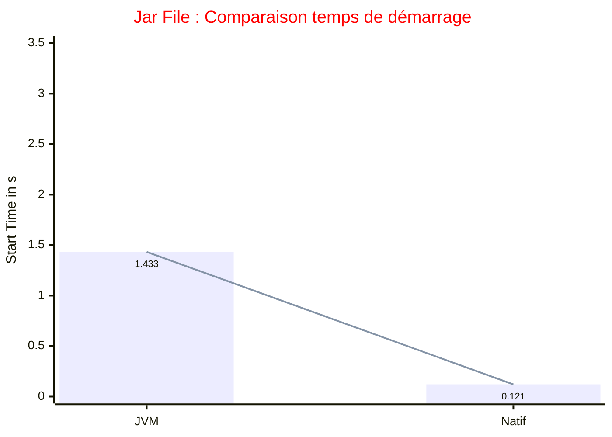
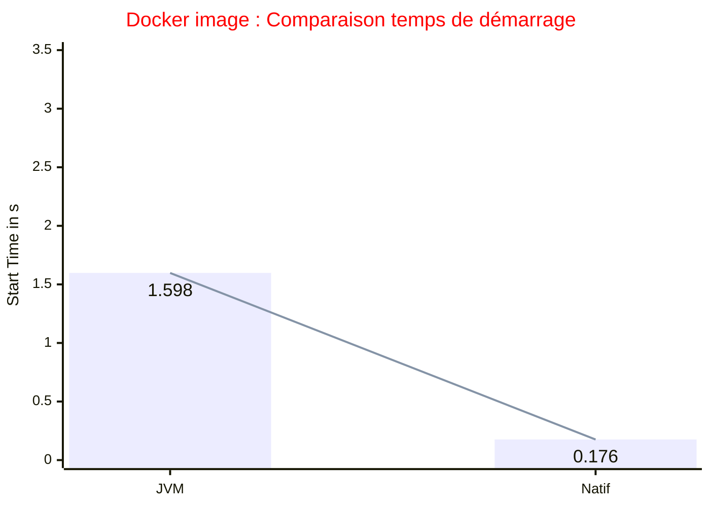

# quarkus-person
## First Application Quarkus
### 🔖 Application Quarkus REST + DB (MySQL ou H2) + Properties + Timer

🌿Démo réalisant des comparaisons de performance entre différentes build d'une même application Quarkus (REST + DB H2 + Properties + Timer)
La comparaison s'éffectue sur :
  - Les temps de start selon différentes configurations
  - Les temps de réponses avec Siege et Hyperfoil

Prérequis : java 21 et docker desktop version 20 minimum

Configuration Maven et Java :
```log
Apache Maven 3.9.6 (bc0240f3c744dd6b6ec2920b3cd08dcc295161ae)
Maven home: /Users/fredericmencier/Projects/apache-maven-3.9.6
Java version: 21.0.4, vendor: Oracle Corporation, runtime: /Users/fredericmencier/.sdkman/candidates/java/21.0.4-oracle
Default locale: fr_FR, platform encoding: UTF-8
OS name: "mac os x", version: "26.0.1", arch: "aarch64", family: "mac"
```

---
Comparer les temps de startup selon les différentes configurations

- [Application Quarkus en mode JVM quarkus:dev]((#Application-Quarkus-en-mode-JVM-quarkus-dev))
- [Application Quarkus en mode JVM avec un jar file](#Application-Quarkus-en-mode-JVM-avec-un-fat-jar)
- [Application Quarkus en mode natif avec GraalVM](#Application-Quarkus-en-mode-natif-avec-GraalVM)
- [Application Quarkus en mode docker JVM avec un jar file](#Application-Quarkus-en-mode-container-docker-JVM-avec-un-jar-file)
- [Application Quarkus en mode docker Natif](#Application-Quarkus-en-mode-container-docker-natif)

---

📌 Tableau récapitulatif des temps de démarrage

| Configuration               | Start Time                 | Taille du livrable |
|-----------------------------|----------------------------|--------------------|
| JVM quarkus:dev             | started in 2.244s          | NA                 |
| JVM avec un jar file        | started in 1.433s          | 696 octets         |
| Natif avec GraalVM          | started in 0.136s 🏃‍♂️‍➡️ | 134.9 Mo           |
| docker JVM avec un jar file | started in 1.731s 🐢       | 522 Mo             |
| docker Natif                | started in 0.176s          | 226 Mo             |
---





---
Par défaut, l'application utilise H2

Utilisation de la base MySql avec le profile : __-Dquarkus-profile=mysql__

---

## Application Quarkus en mode JVM quarkus dev

- Build de l'application
  ```shell
  mvn clean package -DskipTests
  ```
- Run de l'application
  ```shell
  mvn quarkus:dev
  ```

## Application Quarkus en mode JVM avec un jar file

- Build de l'application
  ```shell
  mvn clean package -DskipTests
  ```

- Run de l'application
  ```shell
  java -jar target/quarkus-app/quarkus-run.jar
  ```

## Application Quarkus en mode natif avec GraalVM

👉 Necessite une installation de GraalVM : https://www.graalvm.org/

Ajouter le profile __native__ dans le __pom.xml__

```xml
    <profiles>
        <profile>
            <id>native</id>
            <activation>
                <property>
                    <name>native</name>
                </property>
            </activation>
            <properties>
                <skipITs>false</skipITs>
                <quarkus.native.enabled>true</quarkus.native.enabled>
                <quarkus.native.native-image-xmx>8g</quarkus.native.native-image-xmx>
            </properties>
        </profile>
    </profiles>
```

- Vérification avant le build :

  ```shell
  mvn -version
  ```

  ```log
  Apache Maven 3.9.6 (bc0240f3c744dd6b6ec2920b3cd08dcc295161ae)
  Maven home: /Users/fredericmencier/Projects/apache-maven-3.9.6
  Java version: 21.0.8, vendor: Oracle Corporation, runtime: /Users/fredericmencier/.sdkman/candidates/java/21.0.8-graal
  Default locale: fr_FR, platform encoding: UTF-8
  OS name: "mac os x", version: "14.4.1", arch: "aarch64", family: "mac"
  ```

- Build de l'application
  ```shell
  mvn clean package -DskipTests -Pnative
  ```
  
- Run de l'application
  ```shell
  ./target/quarkus-person-1.0.0-SNAPSHOT-runner
  ```

## Application Quarkus en mode container docker JVM avec un jar file

- Build de l'application
  ```shell
  mvn clean package -DskipTests
  ```

- Packaging de l'app jvm dans une image docker
  ```shell
    docker build -f src/main/docker/Dockerfile.jvm -t person-app-jvm:quarkus-person-app-1.0.0-SNAPSHOT .
  ``` 
  
- Run de l'application
  ```shell
    docker run -i --name person-app-jvm --rm -p 8080:8080 person-app-jvm:quarkus-person-app-1.0.0-SNAPSHOT
  ```

## Application Quarkus en mode container docker natif

L'option __-Dquarkus.native.container-build=true__ permet de créer un executable natif Linux. Cela évite d'avoir un Linux avec GraalVM installé

- Build de l'application
  ```shell
    mvn clean package -Pnative -Dquarkus.native.container-build=true
  ```

- Packaging de l'app native dans une image docker
  ```shell
    docker build -f src/main/docker/Dockerfile.native -t person-app-native:quarkus-person-app-1.0.0-SNAPSHOT .
  ```

- Run de l'application
  ```shell
    docker run -i --name person-app-native --rm -p 8080:8080 person-app-native:quarkus-person-app-1.0.0-SNAPSHOT
  ```

- Mesure de la RSS (Resident Set Size)
  ```shell
    docker exec person-app-native /bin/ps -e -o pid,rss,args
  ```

## Perfomance testing avec Siege (Evolution : oha)
Installation de siege :
- https://github.com/ewwink/siege-windows
- https://github.com/JoeDog/siege
- https://hub.docker.com/r/yokogawa/siege

  ```shell
  siege -t10S -c100 http://localhost:8080/persons
  ```

## Performance testing avec hyperfoil
- https://hyperfoil.io

Utilisation en mode cli :
  ```shell
      docker run -it --rm -v /Users/fredericmencier/Projects/quarkus-first-app/hyperfoil:/benchmarks:Z -v /Users/fredericmencier/Projects/quarkus-first-app/hyperfoil/reports:/tmp/reports:Z quay.io/hyperfoil/hyperfoil cli
      start-local
      upload /benchmarks/personsBenchmark.yml
      run persons-benchmark
      stats
      report --destination=/tmp/reports
  ```

Utilisation avec une commande complète :
```shell
  docker run -it --rm -v /Users/fredericmencier/Projects/quarkus-first-app/hyperfoil:/benchmarks:Z -v /Users/fredericmencier/Projects/quarkus-first-app/hyperfoil/reports:/tmp/reports:Z quay.io/hyperfoil/hyperfoil run -o /tmp/reports /benchmarks/personsBenchmark.yml
```

Utilisation avec un script complet :
  ```shell
    ./hyperfoil/startHyperfoil.sh
  ```

## Consommation mémoire

Affichage des paramètres mémoire par défaut :
  ```shell
  java -XX:+PrintFlagsFinal -version | grep HeapSize
  ```

Utiliser VisualVM pour monitorer la mémoire

- Mesure de la RSS (Resident Set Size)

  La RSS prend une valeur complète de la mémoire (plus réaliste que la Java Heap)

  ```shell
    docker exec person-app-jvm /bin/ps -e -o pid,rss,args | grep quarkus
  ```

- Run de l'application avec tracking memoire
  ```shell
  java -XX:NativeMemoryTracking=summary -jar target/quarkus-app/quarkus-run.jar
  ```

- On utilise `jcmd` pour afficher le rapport de mémoire

    ```shell
    /bin/ps -e -o pid,rss,args | grep quarkus
    ```

    ```shell
    jcmd <pid> VM.native_memory summary scale=MB
    ```

